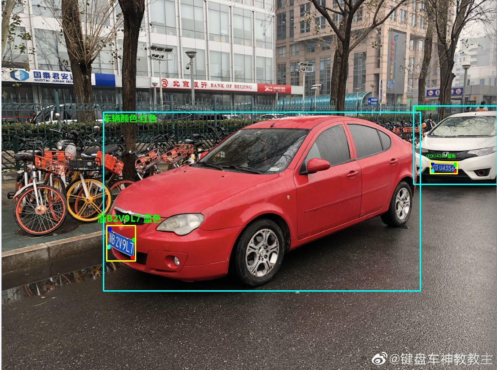

# 车辆识别与车牌检测系统

## 项目概述

本项目是一个基于YOLOv5的车辆识别与车牌检测系统，能够实现：
- 车辆检测
- 车牌检测与识别（支持单层和双层车牌）
- 支持图片和视频流输入

## 环境要求

- Python >= 3.6
- PyTorch >= 1.7
- 其他依赖见requirements.txt

## 快速开始

### 安装依赖

```bash
pip install -r requirements.txt
```

### 使用预训练模型进行检测

```bash
python app.py
```

如果有cuda核心要调用的话需要提前准备cudatoolkit


#### 图片测试

```bash
python Car_recognition.py \
  --detect_model weights/detect.pt \
  --rec_model weights/plate_rec_color.pth \
  --image_path imgs \
  --output result
```

参数说明：
- `--detect_model`: 检测模型路径
- `--rec_model`: 车牌识别模型路径
- `--image_path`: 输入图片目录
- `--output`: 结果保存目录

示例结果：


## 模型训练

### 1. 准备数据集

数据集格式为YOLO格式：
```
label x y w h pt1x pt1y pt2x pt2y pt3x pt3y pt4x pt4y
```
其中关键点依次是（左上，右上，右下，左下），坐标均已归一化。

对于车辆标注，关键点可全部置为-1。

### 2. 配置数据路径

修改`data/widerface.yaml`文件：
```yaml
train: /your/train/path
val: /your/val/path
# 类别数量
nc: 3  # 0:单层车牌 1:双层车牌 2:车辆
# 类别名称
names: ['single_plate', 'double_plate', 'Car']
```

### 3. 开始训练

```bash
python train.py \
  --data data/plateAndCar.yaml \
  --cfg models/yolov5n-0.5.yaml \
  --weights weights/detect.pt \
  --epoch 250
```

训练结果将保存在`run`目录中。

## 模型结构

- 基于YOLOv5n的轻量级检测模型
- 支持3类别检测：车辆、单层车牌、双层车牌
- 车牌识别模型单独训练

## 贡献指南

欢迎提交Pull Request或Issue来改进本项目。

## 许可

本项目采用[MIT License](LICENSE)。
